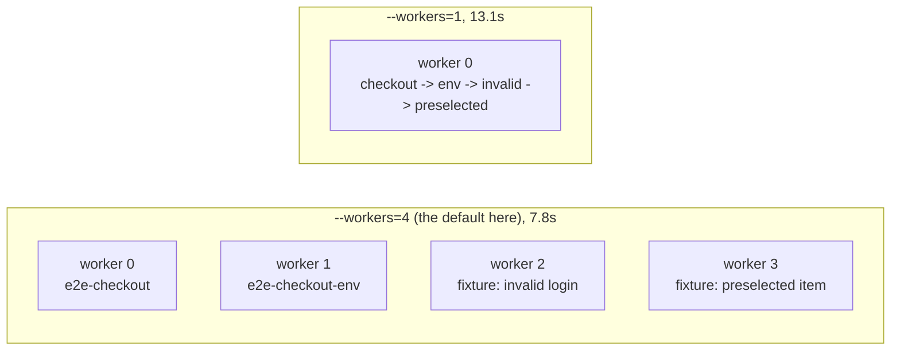

# Playwright Worker Lanes

Playwright splits your tests across parallel worker processes. Each worker is an isolated lane with
its own browser. Understanding what fills those lanes, and what pins everything into one, is the
whole of test parallelism.

Every number below was produced by running the suite on this repo, not quoted from documentation.

> Playwright 1.62.1 &middot; 16 logical cores &middot; macOS &middot; 4 tests across 3 spec files in [`src/tests/e2e/`](../src/tests/e2e/)
> &middot; measured 2026-09-09

## Contents

- [The mental model](#the-mental-model)
- [Measured on this repo](#measured-on-this-repo)
- [How many workers can my machine take?](#how-many-workers-can-my-machine-take)
- [Capacity planning: how long will my suite take?](#capacity-planning-how-long-will-my-suite-take)
- [The commands](#the-commands)
- [Proof, three ways](#proof-three-ways)
- [What controls it](#what-controls-it)
- [Four things that bite](#four-things-that-bite)
- [The one-line rule](#the-one-line-rule)

---

## The mental model

A **worker** is an isolated process with its own browser. Tests are handed out to whatever
lanes are free. Four tests, one browser each: the only question is how many lanes they get to
spread across.



Read the two halves against each other:

- **Four lanes, 7.8s.** The two fixture tests live in the **same file** and still land in different
  lanes. That is `fullyParallel: true` doing its job: it works at test level, not file level.
- **One lane, 13.1s.** Four tests queued nose to tail. This is what `--workers=1` gives you, and
  what `test.describe.serial` forces on a single file whatever the CLI says.

---

## Measured on this repo

Same four e2e tests. Only the worker count changed.

| Command | Wall clock | Saved |
|:--------|-----------:|:------|
| `--workers=1` | 13.1s | baseline |
| `--workers=2` | 9.4s | 3.7s |
| `--workers=4` | 7.8s | 1.6s more |

**Why it stops improving.** Going 1 to 2 workers saved 3.7s. Going 2 to 4 saved only 1.6s more.
With four tests you run out of work to hand out long before you run out of cores. Parallelism
pays off on suite size, not on worker count.

---

## How many workers can my machine take?

First, a correction worth making early: **the default is not fixed at 4.** Playwright's default is
half your logical cores, then capped at the number of tests. This machine has 16 cores, so the
default allows 8, but there are only 4 e2e tests, so 4 workers ran. Add more tests and the number
climbs on its own.

### What a worker actually costs

Peak resident memory for the whole run (Node processes plus browsers), measured on this repo:

| Workers | Headed (this config) | Headless |
|--------:|---------------------:|---------:|
| 1 | 1.70 GB | - |
| 2 | 2.49 GB | - |
| 4 | 3.77 GB | 2.47 GB |

That is close to linear, which gives a usable model:

```text
total RAM = ~1 GB fixed + (workers x per-worker cost)

per-worker cost:  ~0.7 GB headed at 1920x1080
                  ~0.4 GB headless
```

### The table

"Free RAM" assumes the OS, an editor, and a few browser tabs are already running. Take the
**lower** of the two ceilings, because they bind for different reasons.

| System RAM | Free for tests | RAM ceiling (headed) | RAM ceiling (headless) | Typical cores | CPU default (cores / 2) | Practical pick |
|:-----------|---------------:|---------------------:|-----------------------:|--------------:|------------------------:|:---------------|
| 8 GB  | ~4 GB  | 4  | 7  | 4 to 8   | 2 to 4 | **2 headed, 4 headless** |
| 16 GB | ~11 GB | 14 | 25 | 8 to 12  | 4 to 6 | **4 headed, 6 headless** |
| 32 GB | ~26 GB | 35 | 62 | 12 to 16 | 6 to 8 | **8, RAM is not the limit** |

Read the table this way: **RAM only binds on 8 GB machines.** At 16 GB and above you run out of
cores long before you run out of memory, so the CPU column is the real answer. Buying RAM to get
more workers is the wrong upgrade; more cores is the right one.

Work it out for any machine:

```text
workers = min(
    (free RAM in GB - 1) / 0.7,     # 0.4 if headless
    logical cores / 2
)
```

### Headless is the bigger win

At the same 4 workers, on the same 4 tests:

| Mode | Peak RAM | Wall clock |
|:-----|---------:|-----------:|
| Headed (`headless: false`) | 3.77 GB | 7.8s |
| Headless | 2.47 GB | 3.3s |

**35% less memory and 2.4x faster**, from one config flag. Watch the browser while you are writing
a test; run headless everywhere else. This is why CI should never run headed.

### Setting it

```bash
npx playwright test --workers=4          # one run
npx playwright test --workers=50%        # a share of cores, portable across machines
```

```ts
// playwright.config.ts
workers: process.env.CI ? '50%' : 4,
```

The percentage form is the one to teach: `'50%'` behaves sensibly on a student's 8 GB laptop and on
a 32-core CI box without anyone editing the file.

---

## The commands

Run the e2e folder as configured. It is already parallel:

```bash
npx playwright test src/tests/e2e/ --project=chromium
```

Pin the worker count. The CLI flag beats the config file:

```bash
npx playwright test src/tests/e2e/ --workers=4
npx playwright test src/tests/e2e/ --workers=1   # serial, for debugging
```

`--workers=1` is the first thing to try when a test passes alone but fails in a suite.

Run one file, or one test by title:

```bash
npx playwright test src/tests/e2e/e2e-checkout_new_fixture.spec.ts
npx playwright test src/tests/e2e/ -g "checkout successfully"
```

Split across machines on CI:

```bash
npx playwright test --shard=1/3   # machine 1
npx playwright test --shard=2/3   # machine 2
npx playwright test --shard=3/3   # machine 3
```

Workers parallelise **within** one machine. Shards parallelise **across** several. They compose:
each shard still runs its slice with multiple workers.

---

## Proof, three ways

Playwright announces its plan on the first line of every run. Read it before you trust anything else.

```text
# 4 tests across 3 files
Running 4 tests using 4 workers

# 2 tests inside ONE file, still split
Running 2 tests using 2 workers

# 3 tests in a describe.serial block
Running 3 tests using 1 worker
```

That third line is the one people miss. Adding `.serial` silently caps the whole file at one
lane, no matter what `--workers` says.

---

## What controls it

| Knob | Where | Effect |
|:-----|:------|:-------|
| `fullyParallel: true` | `playwright.config.ts` | Tests inside a single file run in parallel too, not just file against file. |
| `workers: N` | `playwright.config.ts` | Not set in this repo, so the default applies: half the logical cores, capped at the number of tests. 16 cores allows 8, but 4 tests means 4 workers. |
| `--workers=N` | CLI | Overrides the config for one run. The fastest way to demo the difference. |
| `test.describe.serial` | spec file | One worker, in order, and the rest of the block skips after the first failure. |
| `test.describe.configure({ mode: 'parallel' })` | spec file | Opts one file into parallel even when `fullyParallel` is off. |
| `--shard=k/n` | CLI | Slices the suite across n machines. Combine with workers, do not choose between them. |

---

## Capacity planning: how long will my suite take?

Four inputs: how many tests, how many machines, how many workers each, and how much RAM per
machine. RAM does not speed anything up; it only sets a ceiling on workers.

### The formula

```text
                 T x D
    time  =  ---------------
              M x W x E


    T = number of tests
    D = mean seconds per test          (the input that matters most)
    M = machines, i.e. --shard=k/M
    W = workers per machine
    E = parallel efficiency, use 0.85  (workers contend for CPU)
```

Then check the worker count actually fits the machine:

```text
    W_max_by_RAM  =  (free GB - 1) / cost_per_worker

        free GB           ~= (total GB x 0.85) - 3     OS, editor, browser tabs
        cost_per_worker   =  0.7 GB headed  |  0.4 GB headless
        fixed 1 GB        =  the Playwright runner itself

    W_actual = min( W_you_asked_for , W_max_by_RAM , logical_cores / 2 )
```

### Values for D, measured on this repo

| Test type | Mean duration | Notes |
|:----------|--------------:|:------|
| UI, headed at 1920x1080 | **6.04s** | this repo's current config |
| UI, headless | **1.74s** | 3.47x faster per test, same tests |
| API (no browser) | **0.59s** | `src/tests/apisTests/` |

Use your own D if you have it. Time a representative few hundred tests and divide. D dominates
every other term, so a measured D beats a guessed one by more than any amount of tuning.

### Worked example

12,000 tests, 4 machines, 8 workers each, 32 GB per machine, headless.

```text
1. Does W fit?   free = (32 x 0.85) - 3 = 24.2 GB
                 W_max = (24.2 - 1) / 0.4 = 58 workers      8 fits easily
2. Time          (12000 x 1.74) / (4 x 8 x 0.85)
                 = 20880 / 27.2
                 = 768s = 12m 48s
```

### Ready reckoner, 12,000 tests

Headed at 6.04s per test:

| Machines | W=4 | W=8 | W=16 | W=32 |
|---------:|----:|----:|-----:|-----:|
| 1  | 5h 55m | 2h 57m | 1h 28m | 44m |
| 2  | 2h 57m | 1h 28m | 44m | 22m |
| 5  | 1h 11m | 36m | 18m | 9m |
| 10 | 36m | 18m | 9m | 4m |
| 20 | 18m | 9m | 4m | 2m |

Headless at 1.74s per test:

| Machines | W=4 | W=8 | W=16 | W=32 |
|---------:|----:|----:|-----:|-----:|
| 1  | 1h 42m | 51m | 26m | 13m |
| 2  | 51m | 26m | 13m | 6m |
| 5  | 20m | 10m | 5m | 3m |
| 10 | 10m | 5m | 3m | 1m |
| 20 | 5m | 3m | 1m | 38s |

Compare the two tables at the same cell. Switching to headless is worth roughly the same as
**tripling your hardware**, and it is one config flag.

### RAM ceiling by machine size

| Machine RAM | Free for tests | Max workers, headed | Max workers, headless |
|:------------|---------------:|--------------------:|----------------------:|
| 8 GB   | ~3.8 GB   | 4   | 6   |
| 16 GB  | ~10.6 GB  | 13  | 23  |
| 32 GB  | ~24.2 GB  | 33  | 57  |
| 64 GB  | ~51.4 GB  | 72  | 125 |
| 128 GB | ~105.8 GB | 149 | 262 |

These are ceilings, not targets. **Above 16 GB you will hit the CPU limit long before the RAM
limit**, so `logical_cores / 2` is almost always the binding term. Adding RAM to run more workers
is the wrong purchase; adding cores or machines is the right one.

### What the formula does not model

The estimate is a floor. Real runs come in above it:

- **Retries.** This repo sets `retries: 2` on CI. A 2% flake rate on 12,000 tests is 240 tests
  running up to three times, and flake rates climb with suite size.
- **Uneven test lengths.** One 5-minute test in a 12,000-test suite sets a hard floor no amount of
  sharding beats. Playwright cannot split a single test.
- **Long-lived workers.** At 12,000 tests and 8 workers each worker runs 1,500 tests, and browser
  memory creeps over a lifetime that long in a way a short run never reveals.
- **Fixed costs per shard.** Checkout, `npm ci`, and browser download run once per machine. At 20
  shards that overhead can exceed the test time itself.
- **E is a convention, not a measurement.** 0.85 is a reasonable planning number; contention
  effects only become measurable on a suite far larger than this one.

---

## Four things that bite

**1. Headed mode opens one window per worker.**
This config sets `headless: false`. Four workers means four Chrome windows at 1920x1080 fighting
for your screen and RAM. For a classroom demo, drop to `--workers=2` or add `--headed=false`.

**2. Shared state breaks the moment tests spread out.**
A `let bookingId` at the top of a file works only because the tests run in order on one worker.
Parallelise it and the second test reads `undefined`. That is exactly why
[`05_crud.spec.ts`](../src/tests/apisTests/01_restfulbooker_raw/05_crud.spec.ts) uses
`describe.serial`, and the cost of that choice is the lane it gives up.

**3. More workers is not always faster.**
Each worker is a real browser process. Past roughly half your cores they compete for CPU and the
suite slows down. The measurements above already flatten between 2 and 4.

**4. Test order stops being predictable.**
Reports come back in completion order, not file order, so runs look shuffled. If a test needs
something an earlier test created, it needs a fixture, not a neighbour.

---

## The one-line rule

**Parallel by default; serial only where state is genuinely shared.**

Every `describe.serial` is a lane you gave up, so make it a decision you can defend rather than a
habit. When a test needs setup, a fixture gives it that setup without costing a lane.

---

Measured 2026-09-09 on AdvancePlaywrightFramework2x, chromium project.
Files: `e2e-checkout.spec.ts`, `e2e-checkout-env.spec.ts`, `e2e-checkout_new_fixture.spec.ts`.